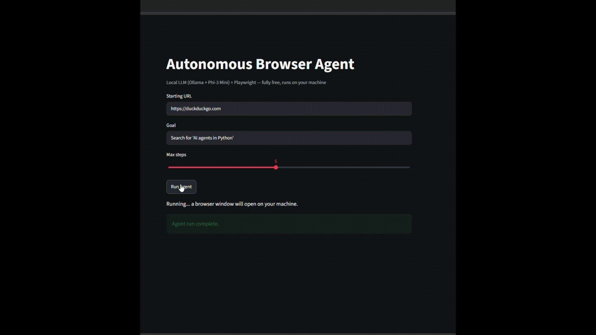

# Autonomous Browser Agent

An AI agent that takes a goal in plain English (e.g. *"Search for 'AI agents in Python'"*) and autonomously navigates a real website to complete it — deciding what to click and type at each step, with no site-specific code.

Built entirely with **free, local tools**: no paid APIs, no cloud costs, no internet dependency once set up.


*(Add your screen recording here — see the "Demo" section below)*

---

## Why this project

Most student "AI agent" projects are chatbots that talk. This one **acts** — it observes a real webpage, reasons about what to do next, and executes real browser actions (typing, clicking) in a loop until the goal is met. This demonstrates the core building block behind computer-use / browser-use agents, using a fully offline stack that costs nothing to run.

## Tech stack

| Component | Tool | Why |
|---|---|---|
| LLM (decision-making) | **Ollama + Phi-3 Mini** | Runs locally, free, small enough for an 8GB RAM laptop with no GPU |
| Browser automation | **Playwright** | Reliable, modern browser control from Python |
| Agent orchestration | Custom loop (Python) | Full visibility/control over the decision loop for learning purposes |
| Demo UI | **Streamlit** | Simple, interactive way to run and observe the agent |

## How it works

```
1. Observe  → Simplify the current webpage into a short numbered list of
              relevant, visible elements (inputs, buttons)
2. Decide   → Send the goal + element list + action history to the LLM;
              it returns ONE action (TYPE / CLICK / DONE)
3. Execute  → Parse the LLM's response and perform that action via Playwright
4. Verify   → Check the resulting page URL/state in CODE (not the LLM) to
              detect whether the goal was actually achieved
5. Repeat   → Go back to step 1, until done or a step limit is reached
```

### Key design decisions

- **Simplify the page before showing it to the LLM.** Raw HTML has thousands of lines of noise. The agent extracts only visible, in-viewport, interactive elements (inputs/buttons) into a short numbered list — this is what makes it possible for a small 3.8B-parameter local model to make reliable decisions at all.
- **Let code verify completion, not the LLM — generically, not with site-specific keywords.** Small local models are unreliable at self-assessing "am I done?" — but they're good at picking single next actions. The first version of completion detection checked the URL for site-specific keywords (`q=` for DuckDuckGo, `wiki/` for Wikipedia), which broke on Amazon's differently-structured search URL. This was replaced with a general check: capture the URL immediately before a CLICK action, and compare it to the URL shortly after. If it changed, the click produced meaningful navigation (almost always a search/submit), regardless of that site's specific URL format. This generalizes to sites never tested against, instead of requiring a growing list of keywords.
- **Tolerant parsing.** Local models don't always follow exact output formats — they drop brackets, use `#` instead of `[ ]`, insert filler words like "with", add commentary, or use inconsistent quotes. A regex-based parser tolerates all of these variations instead of requiring a brittle exact match.
- **Loop and error safeguards.** A repeated-action check prevents infinite loops, and all page actions are wrapped in error handling with short timeouts, so one failed click doesn't crash the whole run — a real, common failure mode in browser agents (e.g. a click accidentally opening a menu that blocks the next click).
- **Wait briefly before verifying.** An early version checked the post-click URL immediately, before slower sites (e.g. Amazon) had finished navigating — causing false negatives. A short deliberate wait before the URL comparison fixed this.

## Demo

Tested successfully on three structurally different sites, showing genuine generalization rather than site-specific hardcoding:

- **DuckDuckGo** — typed a query, clicked search, correctly detected the results page.
- **Wikipedia** — typed a query into a differently-structured search box; even after two intermediate action failures (caused by an autocomplete dropdown shifting the page), the agent still correctly detected task completion via the final URL.
- **Amazon.in** — typed a query, clicked search, and correctly detected the results page via the generic URL-change check — with no Amazon-specific code. This test also surfaced and led to fixing two real bugs: the parser initially failed on a `TYPE #10 with "text"` formatting variation, and the completion check initially ran before Amazon had finished navigating to the results page, producing a false negative. Both were fixed in the version described above.

## Limitations (by design)

- **Not deployed to the cloud.** This project intentionally runs local LLM inference (Ollama) and visible browser automation (Playwright), which aren't compatible with free-tier cloud hosting (no persistent local models, no display for the browser). This is a deliberate free/offline trade-off, not an oversight — demoed here via a recorded run instead.
- **Small model accuracy.** Phi-3 Mini occasionally misidentifies the right element or repeats an action; the loop/parsing safeguards handle this gracefully, but a larger model (e.g. via a paid API) would be more reliable at the cost of losing the free/local property.
- **Simple, structured sites only** — pages with heavy JavaScript, iframes, or CAPTCHAs are out of scope for this version.

## Setup

```bash
pip install playwright langchain langchain-community ollama streamlit
playwright install
ollama pull phi3
```

Run the terminal version:
```bash
python stage4_agent_loop.py
```

Run the Streamlit demo:
```bash
streamlit run app.py
```

## Future improvements

- Add more action types (scroll, wait-for-element, extract-text)
- Swap in a cross-encoder or heuristic scorer to further reduce irrelevant elements shown to the LLM
- Add screenshot-based (vision) page understanding as an alternative to text-based element lists